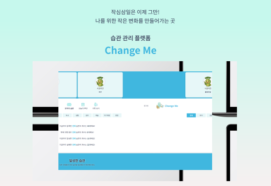

# Change Me

 <br />

#### 개발 기간

- 2025.04.07 ~ 2025.04.28 <br /><br />

#### 🔗 [ChangeMe](https://change-me.vercel.app/)

- 아이디 (테스트 계정) : test8@naver.com
- 패스워드 : a123456!

<br />

## ✅ 프로젝트 소개

의미 없이 흘러가는 시간을 조금 더 나답게,

매일의 작은 반복이 쌓여 변화로 이어질 수 있길 바랐습니다.

<br />

**Change Me**는 매일을 의미 있게 만들고 싶은 사람들을 위해

단순하지만 지속 가능한 습관 관리 도구를 제공합니다.

- 계획이 작심삼일로 끝나지 않도록 매일의 다짐을 기록할 수 있습니다.

- 루틴을 잊지 않도록 오늘 해야 할 일을 한눈에 확인할 수 있습니다.

- 성취감을 느낄 수 있도록 진행 상황을 시각적으로 확인할 수 있습니다.

<br />

## ✅ 팀원 소개

#### 🧑‍💻 [권우진](https://github.com/wojin57)

- DB 및 API 설계
- 클린 아키텍처 기반 프로젝트 구조 설계
- 데일리 메시지 기능 구현
- 습관 상세 보기 기능 구현

#### 👩‍💻 [박은지](https://github.com/EJ-99)

- DB 및 API 설계
- 클린 아키텍처 기반 프로젝트 구조 설계
- 모두의 습관 페이지 구현
- 카테고리 관리 기능 구현

#### 🧑‍💻 [박찬우](https://github.com/pcw7)

- DB 및 API 설계
- 클린 아키텍처 기반 프로젝트 구조 설계
- 회원 인증 기능(회원가입, 로그인) 구현
- 마이페이지 UI 및 기능 구현
- 오늘의 루틴 페이지 구현
- 기록 보기 페이지 구현

#### 🧑‍💻 [이건](https://github.com/leegeon-spinachSW)

- 서비스 기획
- DB 및 API 설계
- 클린 아키텍처 기반 프로젝트 구조 설계
- 기록 보기 페이지 구현

<br />

## ✅ 기술 스택

### 🖥️ 프론트엔드 / 백엔드

<p>
  
  
  
  
  
  
</p>

### 🤝 협업 도구

<p>
  
  
  
</p>

<br/>

## ✅ 프로젝트 구조 (**Clean Architecture 기반**)

```
📂app
├── 📂 api/                 # API 구현
├── 📂...                   # 페이지 구성
📂 application/
├── 📂 usecase/             # 비즈니스 로직 흐름
📂 domain/
├── 📂 entities/            # 도메인 엔티티 정의
├── 📂 repositories/        # 데이터 접근 인터페이스
📂 infra/
├── 📂 repositories/        # Supabase 기반 실제 repository 구현
📂 stores/                  # 전역 상태 관리
📂 utils/                   # 공통 유틸 함수
📂 hooks/                   # 커스텀 훅
📂 public/                  # 정적 파일 (이미지, 폰트)
```

<br />

## ✅ 주요 기능
